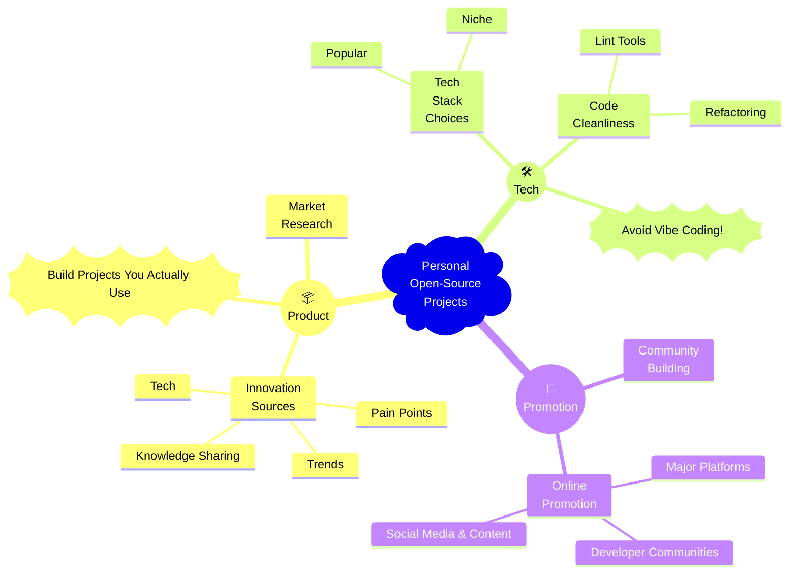

Over the past half year (or to be precise, a year), I've launched three projects on GitHub. To my surprise, these projects turned out to be real overachievers, each snagging more than 100 stars!

Let's take a look at the projects I've built:

| Project | Screenshot |
| --- | --- |
|  A WebRTC-based end-to-end file transfer tool *Launched on 2024-06-19* *Released on 2024-12-02* *172 stars in one day* |  |
|  GitHub Year-End Personal Summary *Launched on 2024-12-14* *Released on 2024-12-15* *26 stars in one day* |  |
|  One-click port status monitoring tool *Launched on 2025-07-20* *Released on 2025-07-24* *53 stars in one day* |  |

The night before launching the third project, I had this gut feeling that it would hit 100+ stars — and it did!

It's not that I'm getting cocky, but after countless nights of pulling my hair out, I think I've discovered the secret recipe for making personal open-source projects go viral.

Today, I’m sharing all my secrets and breaking down my “star-magnet method” into three parts: Product, Technology, and Promotion.

## First Move: Product

### Build a project that makes users say "Wow"

If you want heroes to stop by and hit that shiny star button, you just need to scratch an itch they didn’t know they had. Here are four magical ingredients:

- **Solve a pain point**: There’s a special kind of pain in this world called "unmet needs." Solve a problem that no one else has solved before.

  For instance, my own project  is the only project that I can find which can generate a year-end summary of your GitHub activity!

- **Ride the trend**: Stay on top of the latest buzz and use popular topics or technologies to grab attention. Timing is everything when it comes to viral projects.

  For example, my friend’s  launched during last year’s Nobel Prize announcement, generating a Nobel Prize post according to the photo users uploaded, right when the hype was peaking.

- **Cutting-edge tech**: Build a tool so powerful that even companies want to use it.

  This happens a lot.

- **Awesome**: Be the knowledge courier, creating “awesome-xxx” lists or tutorials.

  My classmate’s  tutorial is a great example — it has a staggering number of stars.

Pick one of these four potions, and your project will have a solid “starter.”

### Don't Follow the Crowd

Every one of my projects gets hit with the same soul-crushing questions from users:

- *What’s different about this project compared to xxx?*
- *Can you add a feature like xxx?*

So, before diving in, take five minutes to check out what everyone else is doing:

1. What similar open-source/commercial projects exist?
2. What are their strengths and weaknesses?
3. Can my idea fill the gaps?

Then, look in the mirror and ask yourself: **Do I really need to reinvent the f\*\*king wheel?**

Let’s be real: the main reason most open-source projects go unnoticed is that they’re just reinventing the wheel. After all, why would users ditch their trusty old tool and embrace your mediocre backup project?

Also, a quick reminder: true innovations should ideally come from genuine needs, not from market research alone. If your "innovation" comes purely from research, it's probably just incremental improvement rather than breakthrough innovation.

### Build Projects You Actually Use

Open-source is essentially a labor of love. There’s no KPI, no bonus — just endless Issues and PRs, plus a few difficult-to-handle users.

A lot of project creators, driven by a spark of inspiration, think, “Hey, this idea is going to be huge!” and dive right in. But a month later, their GitHub repo is gathering dust, with the last update stuck at `init commit`.

In my experience, building a *personal-use project* can keep your open-source motivation high. You’ll spot bugs like, “Oh, that’s broken,” or “Hey, I could optimize that,” which will keep you iterating and improving the project over time — eventually attracting users.

## Second Move: Technology

Technology is probably *the least important* part of most open-source projects. Some projects have code that’s barely functional and still get thousands of stars.

I won’t go into the technical details, but here are a few personal tips for my own open-source projects.

### Choosing Your Tech Stack

That said, choosing the right tech stack is still important. You usually have two options:

- You can choose popular tech stacks to build your project, which speeds up development and provides great community support. If you run into issues, there are tons of “old wise men” to help you out. For example:

  - Frontend: Use frameworks like , , with build tools like .
  - Backend: Pick mainstream languages like Python, Java, Golang, or C++, and frameworks like , , or .

  I’ve noticed that many indie developers seem to be all-in on  — probably thanks to Vercel's great marketing.

  The downside of popular technologies is that making it to GitHub Trending is extremely competitive, and you need to innovate significantly on the features to get noticed.

- Alternatively, you can go for niche tech stacks, which will naturally attract users interested in those technologies.

  A few years ago, this would be like saying “let’s rewrite everything in Rust”—  
  ***O mighty language, activate!***

  Even now, there are plenty of niche tech stacks to experiment with. For example, I’m currently playing around with  (though it's not as niche as it used to be).

  The downside of niche technologies is that you might run into issues with the stack itself, which means waiting for the community to fix them or fixing them yourself. For instance, I ran into a bug with a project, fixed it, and submitted a PR, but the author took six months to merge it!

### Avoid Time Bombs

At work, we can ~~write code that’s impossible for anyone else to maintain — just to make sure we’re safe if we get laid off~~. But for open-source projects, clean and tidy code makes it easier to iterate, and it also attracts other developers to chip in. However, when it’s just you, the code review process doesn’t happen, and your initial architecture probably won’t be perfect.

Refactoring code is tough in a company, but in a personal project, it’s much easier. For small projects, my advice is to focus on two things:

- Early on, add linters (like eslint, pylint) and integrate them into your CI process (e.g., GitHub Actions). This way, you catch issues early, before you get lost in your own code.

- Periodically evaluate if the project needs a refactor. Key moments to refactor include:

  - As your project grows and you add more features, it’s better to split things into modules.
  - If some complex logic starts getting too messy, break it down into separate functions or classes.
  - If you defined a bunch of global variables or utility functions early on, you’ll eventually want better encapsulation.

Remember: clean code makes your project more appetizing, while messy code will make you quit late-night snacks.

### Please, Stop with the Vibe Coding!

**Don’t Vibe Code! Don’t Vibe Code! Don’t Vibe Code!**

AI-assisted programming is fine, but code produced through “vibe coding” is a disaster. You’re responsible for the final result!

## Third Move: Promotion

### Building Your Community

Just like how your profile picture is crucial on social media, your README is the face of your open-source project. A well-written README grabs attention instantly. On the flip side, projects with a one-liner README are usually closed with no second thought.

But it’s not just about the README. Building a community around your open-source project involves several easily overlooked aspects. Here’s what I do:

- **`LICENSE`**: Provide a clear open-source license so users can legally use and contribute. Add this when you first submit your code.
- **`CONTRIBUTING`**: Offer contribution guidelines to help users know how to get involved.
- **`Issue Template`**: Provide clear templates so users can describe issues or feature requests more effectively.
- **`PR Template`**: Offer a PR template to help contributors submit their code properly.
- **`Code of Conduct`**: Include a code of conduct to ensure a friendly, inclusive community.
- **`SECURITY`**: Provide a security reporting channel to ensure users can safely use your project.

If your project has a frontend or CLI, it’s a good idea to add a screenshot or even a demo. A picture is worth a thousand words, and a demo can win hearts instantly.

### Shout It from the Rooftops

Even the finest wine is wasted in a dark alley, and no matter how good your open-source project is, it needs some promotion. I remember  mentioning that his  project blew up after hitting the top of Hacker News.

It's tough for individual developers to land on Hacker News' front page, but you can promote your project through multiple channels. Here are the most effective platforms:

#### Major Platforms

- **[Hacker News](https://news.ycombinator.com/)**: The holy grail of tech promotion. Posting a `Show HN` can bring massive attention. However, HN users are discerning, so your project needs to be genuinely useful and well-executed.

- **[Reddit](https://www.reddit.com/)**: Multiple tech-focused subreddits can help:
  - `r/programming` - For general programming projects
  - `r/IMadeThis` - Perfect for showcasing personal projects
  - `r/webdev`, `r/javascript`, `r/python` - Language/tech-specific communities
  - `r/opensource` - Dedicated to open-source projects
  
  Just be careful about karma thresholds and community rules to avoid being flagged as spam.

- **[Product Hunt](https://www.producthunt.com/)**: Great for products with strong visual appeal or clear user value. The daily launch format creates urgency and competition.

#### Developer Communities

- **[Dev.to](https://dev.to/)**: Write detailed posts about your project's development journey. The community appreciates technical insights and behind-the-scenes stories.

- **[Indie Hackers](https://www.indiehackers.com/)**: Perfect for projects with business potential. Share your building process and metrics.

- **[Lobsters](https://lobste.rs/)**: A smaller, more technical community. Quality over quantity approach works well here.

#### Social Media & Content

- **Twitter/X**: Use relevant hashtags like #opensource, #buildinpublic, #webdev. Engage with the developer community and share progress updates.

- **LinkedIn**: Professional network can be surprisingly effective, especially for B2B tools or career-related projects.

- **YouTube**: Create demo videos or development vlogs. Visual content often performs better than text.

#### Newsletters & Blogs

- **Weekly newsletters**: Many tech newsletters accept submissions for interesting projects. Research newsletters in your niche.

- **Personal blog posts**: Write detailed case studies about your project. This creates evergreen content that can drive long-term traffic.

## Summary and Some Questions

Here’s a mind map summarizing the three moves for easy reference:

```mermaid
mindmap
  root)Personal<br>Open-Source<br>Projects(
    ((📦<br>Product))
      Innovation<br>Sources
        Pain Points
        Trends
        Tech
        Knowledge Sharing
      Market<br>Research
      ))Build Projects You Actually Use((
    ((🛠️<br>Tech))
      Tech<br>Stack<br>Choices
        Popular
        Niche
      Code<br>Cleanliness
        Lint Tools
        Refactoring
      ))Avoid Vibe Coding!((
    ((📢<br>Promotion))
      Community<br>Building
      Online<br>Promotion
        Major Platforms
        Developer Communities
        Social Media & Content
```

While I’ve mastered the art of “brewing” a 100+ star project, there are still two big questions I’m wrestling with:

1. **How do I keep growing, rather than peaking too soon?** Projects usually get a surge of stars during the big promotion push, but soon after, it’s back to getting no stars for days. How do I keep the momentum going?
2. **How do I attract more contributors, instead of flying solo?** I get the occasional PR, but most of the time, I'm doing all the work myself. How can I encourage more people to contribute?

These are the questions I’m still pondering, and I’d love to hear your experiences and thoughts.
