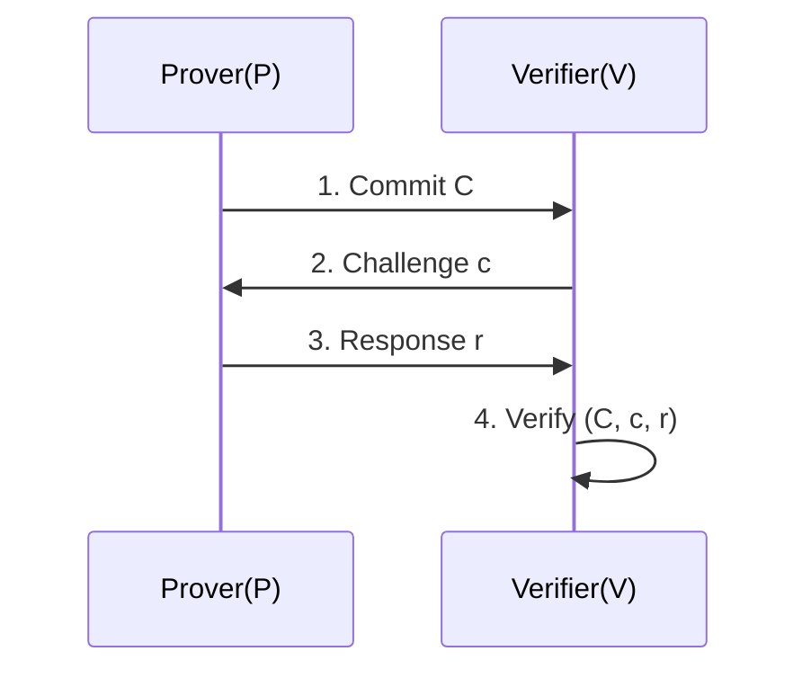
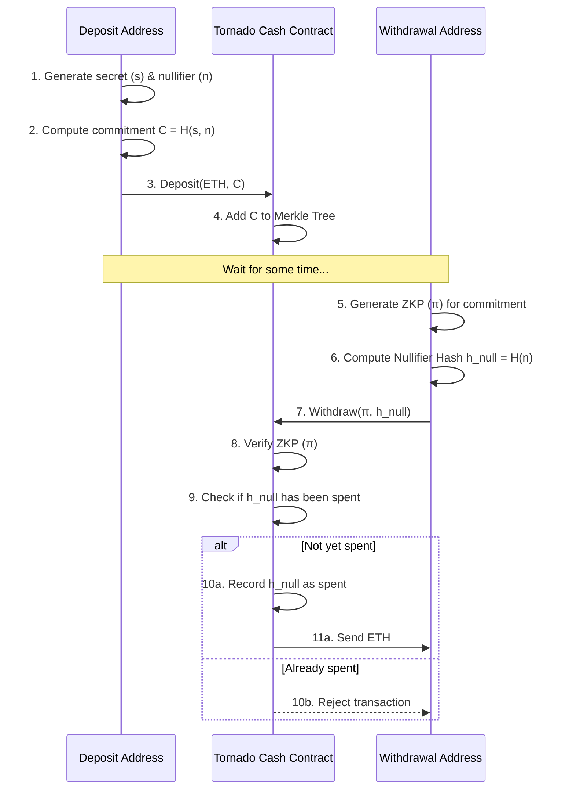
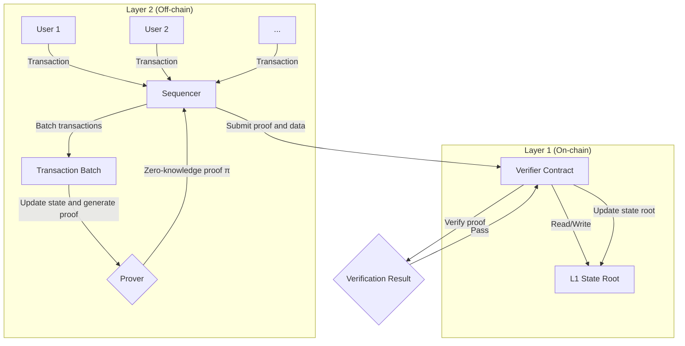

How can you prove you're wearing underwear without revealing its color? You might need to understand zero-knowledge proofs.

To understand this article, you may need basic knowledge of cryptography, including concepts like hash functions and public key cryptography. You'll also need familiarity with computational complexity theory basics such as NP-completeness and graph theory. You can refer to [previous articles](https://blog.ch3nyang.top/post/%E5%AF%86%E7%A0%81%E5%AD%A6%E7%AC%94%E8%AE%B0/) for background.

## Introduction

Imagine we have a 5×5 number grid randomly filled with numbers 1 through 25. We want to prove to someone that the number 25 exists in the grid without revealing its location.

To achieve this, we can cover the entire grid with an opaque mask and cut a hole only at the position where 25 is located. This way, the observer can see the number 25 through the hole, confirming it exists in the grid, but cannot determine its relative position in the table since all other numbers are hidden.

Here's an interactive demonstration showing this concept:



Another classic example is the *Ali Baba cave* problem:

1. The cave has a magic door that requires a password to open, with a circular path inside
2. Alice claims to Bob that she knows the password but doesn't want to tell him directly
3. They design an interactive protocol where Bob waits at the entrance, Alice randomly chooses a path to enter, then Bob randomly calls for her to exit from a specific path
    - If Alice truly knows the password, she can always exit from the requested path (by walking through the middle door)
    - If she doesn't know it, she only has a 50% chance of guessing Bob's request correctly
4. If Bob sees Alice exit from the correct path, he will believe Alice *might* know the password, increasing his trust in her

It's worth noting that if Alice is a cheater, she must "bet" on which exit Bob will ask for before entering the cave. If she bets on exit A, she enters from A; if Bob happens to call A, she succeeds. If Bob calls B, she fails.

After multiple repetitions, Bob gains extremely high confidence that Alice knows the password—but Bob never saw the password itself and doesn't know what it is.

Both examples demonstrate the core idea of zero-knowledge proofs: **proving a statement is true without revealing any additional information**.

## Definition of Zero-Knowledge Proofs

In 1985, Shafi Goldwasser, Silvio Micali, and Charles Rackoff first introduced the concept of zero-knowledge proofs in their paper "The Knowledge Complexity of Interactive Proof Systems." They defined zero-knowledge proofs as a protocol that allows **one party (the prover) to prove to another party (the verifier) that a statement is true without revealing any information beyond the fact that this specific statement is true**.

Zero-knowledge proofs must satisfy three properties:

- ***Completeness***: If the statement to be proven is true, an honest prover can convince an honest verifier
- ***Soundness***: If the proposition is false, a cheating prover has only a negligible chance of convincing an honest verifier that it is true
- ***Zero-knowledge***: If the proposition is true, the verifier learns nothing else beyond this fact during the process

Note that zero-knowledge proofs allow a small probability for a cheating prover to "prove" a false proposition to the verifier. This probability is called the ***soundness error***. In other words, zero-knowledge proofs provide extremely high probability of proving a statement true, but not absolute certainty.

Of course, the above definition is too vague. To precisely describe and prove security in mathematics and computer science, we provide a more formal definition below.

Before giving the definition, let's introduce some necessary concepts:

1. An *interactive proof system* refers to a pair of Turing machines $$\left( P, V \right)$$ that exchange information. Here $$P$$ is the prover; $$V$$ is the verifier, which is a probabilistic polynomial-time (PPT) machine.

    - If the statement is true, $$V$$ accepts the statement with very high probability
    - If the statement is false, any computationally bounded malicious $$P^*$$ can convince $$V$$ to accept the statement with only negligible probability

2. *Zero-knowledge* means that for any (possibly malicious) PPT verifier $$V^*$$, there exists a PPT simulator $$S$$ that can generate an output computationally indistinguishable from the real interaction transcript (i.e., the view of $$V^*$$ when interacting with honest prover $$P$$) without knowing the witness $$w$$.

3. *Computational model and languages*

    Let $$L$$ be an NP language (e.g., $$L=\{all \text{ } satisfiable \text{ } Boolean \text{ } formulas\}$$). For $$x \in L$$, there exists a witness $$w$$ such that $$R_L: (x, w) \in R$$, where $$R$$ is a polynomial-time verifiable relation.

4. *View*

    In a real interaction, the view seen by verifier $$V^*$$ includes:

    - Public input $$x$$ and its own random tape $$r$$ (all possible random choices)
    - Messages received from prover $$P$$
    - For non-black-box simulation cases, the internal state of $$V^*$$

    $$\text{View}_{V^*}^{P}(x) = \left\{ \left( r, m_1, m_2, \cdots, m_t \right) \right\}$$ represents the view of $$V^*$$ when interacting with $$P$$. Here, $$m_i$$ is the message sent by $$P$$ to $$V^*$$ in the $$i$$-th round of interaction.

5. *Simulator*

    A simulator $$S$$ is a PPT algorithm that, given a statement $$x$$ and a description of $$V^*$$, can access $$V^*$$ as a subroutine and attempts to output a view that is distributionally computationally indistinguishable from $$\text{View}_{V^*}^{P}(x)$$.

    - For black-box simulation, $$S$$ treats $$V^*$$ as a black box, cannot access its internal state, and can only interact through input-output
    - For non-black-box simulation, $$S$$ can access the code or internal state of $$V^*$$ and construct simulation accordingly

6. *Computational indistinguishability*

    Two distribution families $$\left\{ X_n \right\}$$ and $$\left\{ Y_n \right\}$$ are computationally indistinguishable if for any PPT distinguisher $$D$$:

    $$
    \left| \Pr\left[ D\left( X_n \right) = 1 \right] - \Pr\left[ D\left( Y_n \right) = 1 \right] \right| < \text{negl}(n)
    $$

    where $$\text{negl}(n)$$ is a negligible function. This expression means the difference approaches zero as $$n$$ increases.

Zero-knowledge proofs are classified into three categories:

- ***Perfect zero-knowledge (PZK)***: The view generated by the simulator is statistically identical to the view of real interaction, i.e.,

  $$
  \text{View}_{V^*}^{P}(x) \equiv S^{V^*}(x)
  $$

- ***Statistical zero-knowledge (SZK)***: The view generated by the simulator and the view of real interaction have negligible statistical distance, i.e.,

  $$
  \text{View}_{V^*}^{P}(x) \approx S^{V^*}(x)
  $$

- ***Computational zero-knowledge (CZK)***: The view generated by the simulator and the view of real interaction are computationally indistinguishable. That is, for any PPT distinguisher $$D$$:

  $$
  \left| \Pr\left[ D\left( \text{View}_{V^*}^{P}(x) \right) = 1 \right] - \Pr\left[ D\left( S^{V^*}(x) \right) = 1 \right] \right| < \text{negl}(n)
  $$

Now we can finally give a formal definition of CZK:

An interactive proof system $$\left( P, V \right)$$ is computational zero-knowledge for language $$L$$ if for any PPT verifier $$V^*$$, there exists a PPT simulator $$S$$ such that for all $$x \in L$$ and auxiliary information $$z$$ given to $$V^*$$:

$$
\left\{ \text{View}_{V^*(z)}^{P}(x) \right\} \approx_c \left\{ S^{V^*(z)}(x, z) \right\}
$$

where:

- $$\text{View}_{V^*(z)}^{P}(x)$$ is the view of $$V^*$$ after interacting with $$P$$ on input $$x$$ and auxiliary information $$z$$
- $$\approx_c$$ denotes computational indistinguishability
- $$S^{V^*(z)}(x, z)$$ is the output of simulator $$S$$ without knowing the witness

## Interactive Zero-Knowledge Proof Protocols

Based on the above content, we can design some zero-knowledge proof protocols. They typically include the following steps:

1. *Commitment*: The prover $$P$$ generates a commitment value $$C$$ and sends it to the verifier $$V$$. This commitment value is an encrypted representation of some secret information $$w$$, ensuring that $$P$$ cannot change $$w$$ in subsequent steps

2. *Challenge*: The verifier $$V$$ randomly selects a challenge $$c$$ and sends it to $$P$$. This challenge is usually randomly chosen from a predefined set

3. *Response*: The prover $$P$$ computes a response $$r$$ based on the challenge $$c$$ and secret information $$w$$, and sends it to $$V$$

4. *Verification*: The verifier $$V$$ uses the commitment value $$C$$, challenge $$c$$, and response $$r$$ to verify whether the prover $$P$$ knows the secret information $$w$$. If verification passes, $$V$$ accepts the proof; otherwise rejects it

This protocol is called a ***Sigma protocol*** because its three-step structure (Commit-Challenge-Response) resembles the Greek letter $$\Sigma$$. Below we analyze this through the classic Schnorr protocol.

### Schnorr Protocol

One of the most classic interactive zero-knowledge proofs is the **Schnorr protocol**, used to prove knowledge of discrete logarithms. In this problem, given a cyclic group $$\mathbb{G}$$ with generator $$g$$ and order $$q$$, the public information is $$y \in \mathbb{G}$$, and prover Alice claims she knows a secret $$x \in \mathbb{Z}_q$$ such that $$y = g^x$$. She wants to prove this to verifier Bob without revealing the value of $$x$$.

#### Protocol Steps

1. **Commitment**: Alice chooses a random number $$r \in \mathbb{Z}_q$$ (called a nonce), computes commitment $$C = g^r$$, and sends $$C$$ to Bob
2. **Challenge**: Bob chooses a random challenge $$c \in \mathbb{Z}_q$$ and sends it to Alice
3. **Response**: Alice computes response $$s = r + cx \pmod q$$ and sends $$s$$ to Bob
4. **Verification**: After receiving $$s$$, Bob verifies whether the equation $$g^s = C \cdot y^c$$ holds

#### Protocol Analysis

- **Completeness**: If Alice is honest, she knows $$x$$ and follows the protocol. Bob's verification will pass because:

    $$
    g^s = g^{r+cx} = g^r \cdot g^{cx} = g^r \cdot (g^x)^c = C \cdot y^c
    $$

    Therefore, an honest prover can always convince an honest verifier

- **Soundness**: If Alice is a cheater who doesn't know $$x$$, can she deceive Bob? To pass verification, she must provide an $$s$$ that makes $$g^s = C \cdot y^c$$ hold after receiving challenge $$c$$

    Suppose cheating Alice sends some commitment $$C$$. When she receives challenge $$c$$, she needs to find an $$s$$. Since she doesn't know $$x$$, she cannot compute the correct $$s$$ through $$s = r + cx$$. Her only chance of success is to guess the challenge $$c^\prime$$ that Bob will send before sending $$C$$

    - She can choose a random $$s^\prime$$, then compute $$C = g^{s^\prime} \cdot y^{-c^\prime}$$
    - She sends this $$C$$ to Bob. If Bob happens to return challenge $$c = c^\prime$$, she can use $$s^\prime$$ as the response, and verification will pass
    - However, since $$c$$ is randomly chosen from $$\mathbb{Z}_q$$, her probability of guessing correctly is only $$1/q$$, which is a negligible probability. Therefore, the protocol is sound

- **Zero-knowledge**: To prove zero-knowledge, we need to construct a simulator $$S$$ that can generate an output computationally indistinguishable from the real interaction transcript $$(C, c, s)$$ without knowing the secret $$x$$

    Simulator $$S$$ works as follows:

    1. Choose random $$s^\prime \in \mathbb{Z}_q$$ and $$c^\prime \in \mathbb{Z}_q$$
    2. Compute fake commitment $$C^\prime = g^{s^\prime} \cdot y^{-c^\prime}$$
    3. Output triple $$(C^\prime, c^\prime, s^\prime)$$ as the simulated interaction transcript

    This simulated triple $$(C^\prime, c^\prime, s^\prime)$$ has exactly the same distribution as the triple $$(C, c, s)$$ generated in real interaction. In the real protocol, $$r$$ is random, $$c$$ is random, which makes $$s=r+cx$$ also random; in simulation, $$s^\prime$$ and $$c^\prime$$ are random, which makes $$C^\prime$$ also random. Since $$C, c, s$$ are all uniformly random elements over $$\mathbb{Z}_q$$, no one can distinguish whether $$(C, c, s)$$ comes from real interaction or the simulator. Therefore, the verifier gains no information about $$x$$

### Hamiltonian Cycle Problem for Large Graphs

Another classic interactive proof example is the Hamiltonian cycle problem for graphs. This is a famous NP-complete problem. Suppose Alice (prover) wants to prove to Bob (verifier) that she knows a Hamiltonian cycle of a large graph $$G$$ (i.e., a closed path that visits each vertex exactly once), but doesn't want to reveal the specific cycle.

#### Protocol Steps

1. **Commitment**: Alice knows graph $$G=(V, E)$$ and a Hamiltonian cycle $$C$$. She generates a random vertex permutation $$\pi$$ and uses it to construct a new graph $$H = \pi(G)$$. This new graph $$H$$ is isomorphic to $$G$$. Then Alice commits to the adjacency matrix of graph $$H$$ and sends the commitment value $$comm(H)$$ to Bob

    > A commonly used commitment scheme is to hash each element of the adjacency matrix, then build these hash values into a Merkle Tree, and use the tree root as commitment $$comm(H)$$

2. **Challenge**: After receiving the commitment, Bob randomly chooses a bit $$b \in \{0, 1\}$$ as a challenge and sends it to Alice

3. **Response**:

    - If $$b=0$$, Alice reveals the permutation $$\pi$$
    - If $$b=1$$, Alice reveals the Hamiltonian cycle $$C^\prime = \pi(C)$$ in $$H$$ and provides Merkle proofs for all edges constituting this cycle to prove they are indeed part of $$H$$

4. **Verification**:

    - If Bob's challenge is $$b=0$$, he verifies whether $$H = \pi(G)$$ holds
    - If Bob's challenge is $$b=1$$, he verifies whether $$C^\prime$$ is indeed a Hamiltonian cycle of $$H$$

#### Protocol Analysis

- **Completeness**: If Alice knows the Hamiltonian cycle, she can always correctly respond to any of Bob's challenges
- **Soundness**: If Alice doesn't know the Hamiltonian cycle, she can only guess Bob's challenge. She can prepare an isomorphic graph $$H$$ (corresponding to $$b=0$$ case), or prepare a graph $$H$$ containing a Hamiltonian cycle but unrelated to $$G$$ (corresponding to $$b=1$$ case). In either case, her probability of successfully deceiving Bob is only $$50%$$
- **Zero-knowledge**: In a single interaction, if Bob challenges $$b=0$$, he only sees a random graph isomorphism and gains no information about the Hamiltonian cycle. If he challenges $$b=1$$, he only sees a Hamiltonian cycle in a random graph and cannot map it back to the original graph $$G$$. Therefore, Bob gains no knowledge about the Hamiltonian cycle in $$G$$

## Non-Interactive Zero-Knowledge Proofs

The above zero-knowledge proof protocols all require multiple rounds of interaction between the prover and verifier. However, in certain scenarios, such as blockchain transactions or digital signatures, proofs need to be broadcast to multiple verifiers or verified at different times, making multiple rounds of interaction impractical.

***Non-interactive zero-knowledge proofs (NIZK)*** solve this problem. In NIZK, the prover can generate a single proof string $$\pi$$, and any verifier with public information can independently verify the proof at any time without any interaction with the prover.

NIZK implementation typically relies on common, trusted reference information, called the **Common Reference String (CRS)** model. The CRS is shared among all protocol participants and is considered trusted.

### Fiat-Shamir Transform

The key idea for converting interactive proofs to non-interactive proofs is to eliminate the random challenges provided by the verifier. The ***Fiat-Shamir transform*** is a famous technique for achieving this, which is secure under the **Random Oracle Model (ROM)**.

In ROM, we assume there exists an ideal cryptographic hash function $$H$$ that behaves like a random oracle: for any new input, it returns a truly random, uniformly distributed output.

The core idea of the Fiat-Shamir transform is: the prover uses hash function $$H$$ to self-generate challenges instead of receiving them from the verifier. The specific steps are:

1. The prover executes the **commitment** step of the interactive protocol, generating commitment value $$C$$

2. The prover takes all public information (such as problem statement $$x$$) and the current round's commitment $$C$$ as input, and computes the challenge through hash function $$H$$:

    $$
    c = H(x, C)
    $$

3. The prover uses this self-generated challenge $$c$$ to compute the **response** $$s$$

4. The final non-interactive proof $$\pi$$ consists of the commitment and response, i.e., $$\pi = (C, s)$$

After receiving proof $$\pi = (C, s)$$, the verifier can independently perform the following operations:

1. Use the same public information $$x$$ and commitment $$C$$ from the proof to compute the challenge: $$c^\prime = H(x, C)$$
2. Use the computed challenge $$c^\prime$$ and response $$s$$ from the proof to execute the **verification** step of the original interactive protocol

Since the output of cryptographic hash functions is deterministic (the same input always produces the same output) and unpredictable (the hash value cannot be known before computing it), this hash value effectively replaces the random challenge provided by a real verifier. The prover cannot cheat by pre-designing commitments as in interactive protocols because they cannot predict the hash function's output.

We can apply the Fiat-Shamir transform to the aforementioned Schnorr protocol to obtain a non-interactive signature scheme (Schnorr signature):

1. **Proof Generation (Signing)**:

    - Alice (prover) has secret $$x$$ and public key $$y=g^x$$
    - She chooses a random number $$r \in \mathbb{Z}_q$$, computes commitment $$C = g^r$$
    - She uses hash function $$H$$ to compute challenge $$c = H(y, C)$$
    - She computes response $$s = r + cx \pmod q$$
    - The non-interactive proof (i.e., signature) is $$\pi = (C, s)$$

2. **Proof Verification (Signature Verification)**:

    - Bob (verifier) has Alice's public key $$y$$ and signature $$\pi = (C, s)$$
    - He computes challenge $$c^\prime = H(y, C)$$
    - He verifies whether equation $$g^s = C \cdot y^{c^\prime}$$ holds

This process requires no interaction; Alice only needs to publish her signature $$\pi$$, and anyone can verify it.

### zk-SNARKs vs zk-STARKs

In the NIZK field, **zk-SNARKs** and **zk-STARKs** are currently the two most important and widely used technologies. Both are designed to generate efficient, non-interactive zero-knowledge proofs, but they differ significantly in implementation and characteristics.

- **zk-SNARK (Zero-Knowledge Succinct Non-Interactive Argument of Knowledge)**
    - **Advantages**:
        - **Succinctness**: Proof sizes are very small, typically only a few hundred bytes, making them very suitable for use in storage-constrained environments like blockchains
        - **Fast Verification**: The verification process is very efficient with low computational overhead
    - **Disadvantages**:
        - **Requires Trusted Setup**: Most zk-SNARK schemes require a complex initial setup phase to generate public parameters. This process produces some "toxic waste"—if these secret data are not securely destroyed, attackers can use them to forge proofs. This trusted setup ceremony requires participants to be highly honest
        - **Not Quantum-Resistant**: Many elliptic curve-based zk-SNARK schemes cannot resist attacks from quantum computers

- **zk-STARK (Zero-Knowledge Scalable Transparent Argument of Knowledge)**
    - **Advantages**:
        - **Transparency**: No trusted setup required. Its public parameters are generated using public, verifiable randomness, eliminating dependence on trusted setup ceremonies and being more secure
        - **Scalability**: When the computational scale to be proven increases, its proof generation and verification time growth rate is better than zk-SNARKs
        - **Quantum-Resistant**: It's based on simpler cryptographic assumptions (collision-resistant hash functions), so it's considered quantum-resistant
    - **Disadvantages**:
        - **Large Proof Size**: Its proof sizes are much larger than zk-SNARKs (typically tens to hundreds of KB), which increases on-chain storage costs and network transmission overhead

| Feature | zk-SNARK | zk-STARK |
| :--- | :--- | :--- |
| **Proof Size** | Very Small (Succinct) | Larger |
| **Trusted Setup** | Usually Required | Not Required (Transparent) |
| **Quantum Resistance**| Usually Not | Yes |
| **Cryptographic Assumptions** | Elliptic Curves, Pairings | Collision-Resistant Hash Functions |

In summary, NIZK technologies, particularly zk-SNARKs and zk-STARKs, are key to driving zero-knowledge proofs from theory to large-scale practical applications. They make complex verification while protecting privacy possible, opening new doors for blockchain scaling, decentralized identity, and other fields.

## Applications

Zero-knowledge proofs have extremely wide application scenarios, especially in fields requiring privacy protection and verifiable computation.

### Privacy Transactions and Coin Mixers

***Coin mixers*** aim to break the traceability of cryptocurrency transaction graphs. Tornado Cash is a classic ZKP-based implementation.

The core idea is: users deposit funds into a smart contract "pool," and later can withdraw the same amount of funds from a completely new address. Since the pool mixes large amounts of funds from different users, external observers cannot associate deposits with withdrawals.

The protocol flow is as follows:

1. **Deposit**:

    - User Alice wants to deposit a certain amount of tokens (e.g., 1 ETH). She first generates two large random numbers: one as a secret $$s$$, another as a nullifier $$n$$

    - She computes a commitment $$C$$, typically the hash of these two random numbers: $$C = H(s, n)$$

    - Alice sends 1 ETH and this commitment $$C$$ to the Tornado Cash smart contract. The contract adds $$C$$ to a deposit list (usually a Merkle tree)

2. **Withdrawal**:

    - After waiting for some time, Alice wants to withdraw from a completely new address B that has no association with the deposit address

    - She needs to prove to the smart contract that she knows the secret $$s$$ and nullifier $$n$$ corresponding to some valid commitment $$C$$. This is a typical "proof of knowledge" problem

    - She constructs a zk-SNARK proof $$\pi$$ that states the following:

        *I know a pair $$(s, n)$$ such that:*

        1. *Its commitment $$C = H(s, n)$$ exists in the contract's deposit Merkle tree (proven by providing a Merkle path)*
        2. *I can correctly compute the nullifier hash $$h_{null} = H(n)$$*

    - Alice submits proof $$\pi$$ and nullifier hash $$h_{null}$$ to the contract

    - Verification and double-spending prevention:

        - The contract's verifier checks whether proof $$\pi$$ is valid. This verification process doesn't reveal $$s$$, $$n$$, or the original commitment $$C$$

        - The contract checks whether $$h_{null}$$ has already been recorded in the "spent" list. If not recorded, the contract records $$h_{null}$$ and sends 1 ETH to address B. If already recorded, it rejects the transaction to prevent the same deposit from being withdrawn multiple times (double-spending attack)

Through this process, Alice successfully transfers funds without revealing any associating information, achieving privacy protection.

### Blockchain Scaling

ZK-Rollups are a Layer 2 scaling solution that moves large amounts of transaction computation and state storage off-chain, but keeps compressed data for each transaction and validity proofs on-chain, thereby inheriting the security of the main chain.

The working principle is as follows:

1. **Off-chain Transaction Processing**:

    - One or more nodes called sequencers or operators are responsible for collecting users' off-chain transactions

    - The operator processes these transactions (e.g., thousands of transfers) and updates the off-chain state tree (a large Merkle tree recording all account balances and states). This process changes from the old state root $$S_{old}$$ to a new state root $$S_{new}$$

2. **Proof Generation**:

    - For this batch of all transactions, the operator needs to generate a zero-knowledge proof $$\pi$$ (usually zk-SNARK or zk-STARK)

    - This proof $$\pi$$ verifies the following statement:

        *There exists a batch of transactions $$T$$ that, when applied sequentially to a state with state root $$S_{old}$$, legally produces a new state root $$S_{new}$$.*

    - "Legally" means each transaction has a valid signature, the sender has sufficient balance, and all state transitions follow protocol rules

3. **On-chain Verification**:

    - The operator submits this succinct proof $$\pi$$, old state root $$S_{old}$$, new state root $$S_{new}$$, and some highly compressed transaction data (to ensure data availability) to a smart contract on the main chain

    - The verifier contract on the main chain executes the verification algorithm `Verify(π, S_old, S_new, data)`. This verification process is very fast and cost-effective, far less than executing thousands of transactions on the main chain

    - If verification passes, the contract updates the on-chain stored state root to $$S_{new}$$

Through this method, main chain nodes don't need to execute every transaction, only verify one proof, thereby improving throughput by several orders of magnitude. zkSync and StarkNet are famous projects based on this technology.

### Decentralized Identity and Verifiable Credentials

Zero-knowledge proofs allow users to selectively disclose their identity information rather than revealing everything.

Suppose you need to prove to an online service that you are over 18 years old, but don't want to reveal your name, exact birth date, or any other information. The traditional approach is to upload a photo of your ID card. This would expose your name, address, exact birth date, and all other information, posing serious privacy risks.

Using zero-knowledge proofs, you can achieve this through the following method:

1. **Credential Issuance**: A government or trusted institution (Issuer) issues you a digitally signed verifiable credential containing your various attributes, such as `{"name": "Alice", "birthDate": "2005-05-20"}`

2. **Proof Generation**: When you need to prove your age, your wallet application generates a ZKP proving the following statement:

    *I hold a valid credential signed by a trusted institution's public key, and the `birthDate` field in the credential represents an age greater than or equal to 18 years.*

3. **Verification**: You submit this proof to the online service. The service only needs to verify the validity of the proof to be confident that you are of age, without knowing your name, specific birthday, or any other personal information

### Protecting Machine Learning Model Privacy

In certain scenarios, model owners want to prove to users that their model's prediction results are correct, but don't want to leak the model itself (because the model is valuable intellectual property).

For example, a fintech company has developed a proprietary credit scoring model $$M$$. Users input their financial data $$x$$, and the company returns a credit score $$y = M(x)$$. How can users trust that this score $$y$$ was honestly computed by that claimed advanced model $$M$$, rather than just a random number given by the company for its own benefit?

Zero-knowledge proofs can help solve this problem. The specific process is:

1. The company first commits to the structure and weights of model $$M$$, and publishes the commitment value $$comm(M)$$

2. When a user submits data $$x$$, the company computes $$y = M(x)$$

3. The company simultaneously generates a ZKP $$\pi$$ proving:

    *For the public input $$x$$ and output $$y$$, I know a model $$M$$ such that $$y=M(x)$$ holds, and this model $$M$$'s commitment is consistent with the public $$comm(M)$$.*

4. The user receives score $$y$$ and proof $$\pi$$. By verifying $$\pi$$, the user can be confident that the score was honestly computed by the claimed model, while the company hasn't leaked any internal details of its model
