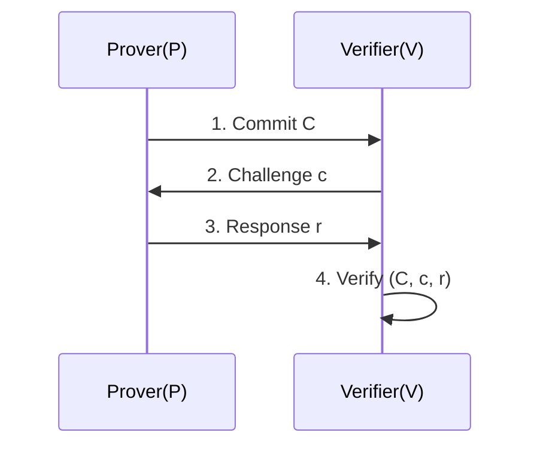
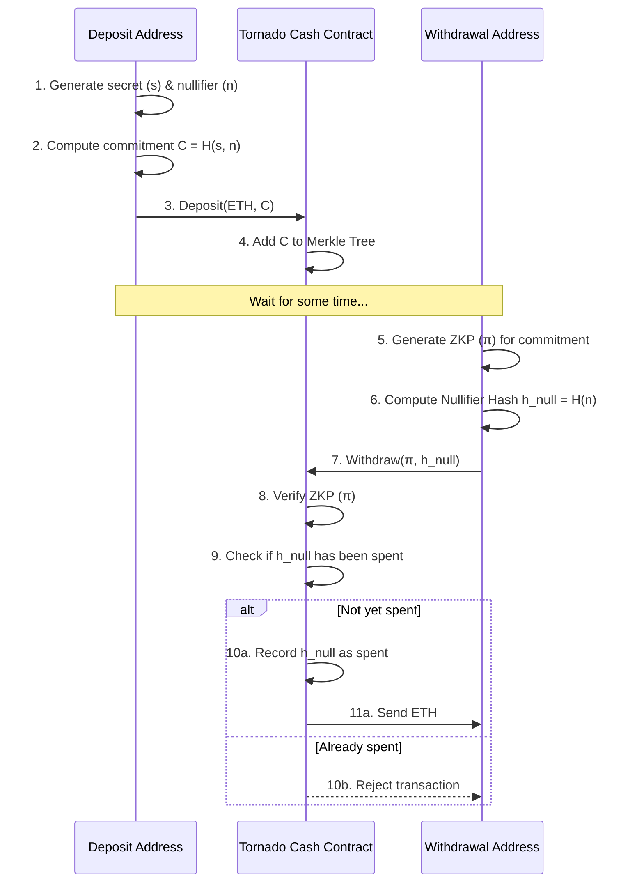
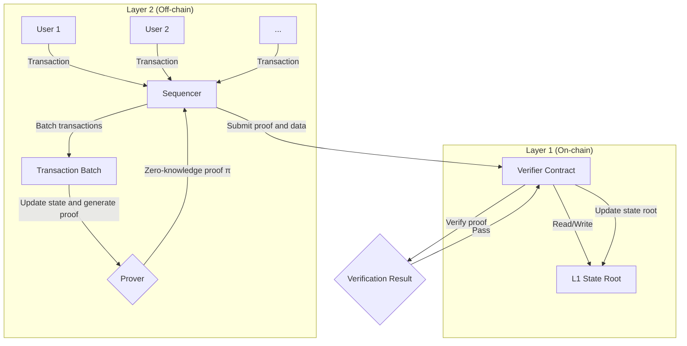

How can you prove you're wearing underwear without revealing its color? The answer lies in understanding zero-knowledge proofs.

This article assumes basic familiarity with cryptographic concepts (hash functions, public key cryptography) and computational complexity theory (NP-completeness, graph theory). For background material, you can refer to [previous articles](https://blog.ch3nyang.top/post/%E5%AF%86%E7%A0%81%E5%AD%A6%E7%AC%94%E8%AE%B0/).

## Introduction

Consider a simple example: suppose you have a 5×5 grid randomly filled with numbers 1 through 25, and you want to prove that the number 25 exists somewhere in the grid without revealing its exact location.

You could accomplish this by covering the entire grid with an opaque sheet and cutting out a small window only where 25 is located. This allows an observer to see the number 25 through the window—confirming its presence—while keeping all other numbers hidden, making it impossible to determine the number's position within the grid.

Here's an interactive demonstration showing this concept:



A more famous example is the *Ali Baba cave* problem:

1. There's a cave with a circular passage and a magic door in the middle that opens only with a secret password
2. Alice claims she knows the password but doesn't want to reveal it to Bob
3. They design an interactive protocol: Bob waits at the entrance while Alice randomly chooses which path to take into the cave. Bob then randomly calls out which path he wants her to exit from
    - If Alice truly knows the password, she can always comply with Bob's request (by passing through the magic door if necessary)
    - If she doesn't know the password, she can only guess correctly about which exit Bob will request 50% of the time
4. When Bob sees Alice consistently exit from the path he requested, his confidence that she knows the password increases dramatically

The key insight is that if Alice is cheating, she must gamble on which exit Bob will request before entering the cave. If she guesses exit A and enters from that side, she succeeds only if Bob happens to call for exit A. If Bob calls for exit B, she's caught.

After many repetitions, Bob develops extremely high confidence that Alice knows the password—yet he never learns the password itself or gains any information about what it might be.

Both examples illustrate the fundamental principle of zero-knowledge proofs: **proving the truth of a statement without revealing any additional information beyond the fact that the statement is true**.

## Definition of Zero-Knowledge Proofs

In 1985, Shafi Goldwasser, Silvio Micali, and Charles Rackoff introduced the concept of zero-knowledge proofs in their seminal paper "The Knowledge Complexity of Interactive Proof Systems." They defined zero-knowledge proofs as protocols that enable **one party (the prover) to convince another party (the verifier) that a statement is true without revealing any information beyond the truth of that specific statement**.

Zero-knowledge proofs must satisfy three essential properties:

- ***Completeness***: If the statement is true, an honest prover can always convince an honest verifier
- ***Soundness***: If the statement is false, a dishonest prover has only negligible probability of convincing an honest verifier that it is true
- ***Zero-knowledge***: If the statement is true, the verifier learns nothing beyond this fact during the entire protocol execution

It's important to note that zero-knowledge proofs allow a small probability for a dishonest prover to successfully "prove" a false statement. This probability is called the ***soundness error***. In practice, zero-knowledge proofs provide extremely high confidence in proving statements true, but not absolute mathematical certainty.

The informal definition above, while intuitive, lacks the precision needed for mathematical analysis and security proofs. Below we provide the formal definitions used in cryptographic research.

Before presenting the formal definition, we need to establish several key concepts:

1. An *interactive proof system* consists of a pair of Turing machines $$\left( P, V \right)$$ that communicate with each other. Here $$P$$ represents the prover and $$V$$ represents the verifier, where $$V$$ is constrained to run in probabilistic polynomial time (PPT).

    - If the statement is true, $$V$$ accepts with overwhelming probability
    - If the statement is false, no computationally bounded adversarial prover $$P^*$$ can convince $$V$$ to accept except with negligible probability

2. *Zero-knowledge* means that for any (possibly malicious) PPT verifier $$V^*$$, there exists a PPT simulator $$S$$ that can produce output computationally indistinguishable from the real interaction transcript—that is, from the view that $$V^*$$ would have when interacting with the honest prover $$P$$—all without knowing the secret witness $$w$$.

3. *Computational model and languages*

    Let $$L$$ be an NP language (for example, $$L = \{\text{all satisfiable Boolean formulas}\}$$). For any $$x \in L$$, there exists a witness $$w$$ such that $$(x, w) \in R_L$$, where $$R_L$$ is a polynomial-time verifiable relation.

4. *View*

    During a real interaction, the view that verifier $$V^*$$ observes consists of:

    - The public input $$x$$ and its own random tape $$r$$ (containing all random choices)
    - All messages received from the prover $$P$$
    - In non-black-box simulation scenarios, the internal state of $$V^*$$

    We denote $$\text{View}_{V^*}^{P}(x) = \left\{ \left( r, m_1, m_2, \ldots, m_t \right) \right\}$$ as the view that $$V^*$$ obtains when interacting with $$P$$, where $$m_i$$ represents the message that $$P$$ sends to $$V^*$$ in the $$i$$-th round.

5. *Simulator*

    A simulator $$S$$ is a PPT algorithm that, given a statement $$x$$ and access to $$V^*$$, attempts to produce a view that is computationally indistinguishable from $$\text{View}_{V^*}^{P}(x)$$.

    - In *black-box simulation*, $$S$$ treats $$V^*$$ as a black box—it cannot examine $$V^*$$'s internal state and can only interact through inputs and outputs
    - In *non-black-box simulation*, $$S$$ can examine the code or internal state of $$V^*$$ to construct its simulation accordingly

6. *Computational indistinguishability*

    Two distribution ensembles $$\left\{ X_n \right\}$$ and $$\left\{ Y_n \right\}$$ are computationally indistinguishable if for any PPT distinguisher $$D$$:

    $$
    \left| \Pr\left[ D\left( X_n \right) = 1 \right] - \Pr\left[ D\left( Y_n \right) = 1 \right] \right| < \text{negl}(n)
    $$

    where $$\text{negl}(n)$$ is a negligible function (one that decreases faster than any polynomial as $$n$$ grows).

Zero-knowledge proofs are classified into three categories based on the strength of their security guarantees:

- ***Perfect zero-knowledge (PZK)***: The simulator's output is distributed identically to the real interaction view:

  $$
  \text{View}_{V^*}^{P}(x) \equiv S^{V^*}(x)
  $$

- ***Statistical zero-knowledge (SZK)***: The simulator's output and the real interaction view are statistically close (negligible statistical distance):

  $$
  \text{View}_{V^*}^{P}(x) \approx_s S^{V^*}(x)
  $$

- ***Computational zero-knowledge (CZK)***: The simulator's output and the real interaction view are computationally indistinguishable—no PPT distinguisher $$D$$ can tell them apart:

  $$
  \left| \Pr\left[ D\left( \text{View}_{V^*}^{P}(x) \right) = 1 \right] - \Pr\left[ D\left( S^{V^*}(x) \right) = 1 \right] \right| < \text{negl}(n)
  $$

We can now provide the formal definition of computational zero-knowledge:

**Definition:** An interactive proof system $$\left( P, V \right)$$ is *computational zero-knowledge* for language $$L$$ if for every PPT verifier $$V^*$$, there exists a PPT simulator $$S$$ such that for all $$x \in L$$ and any auxiliary information $$z$$ given to $$V^*$$:

$$
\left\{ \text{View}_{V^*(z)}^{P}(x) \right\} \approx_c \left\{ S^{V^*(z)}(x, z) \right\}
$$

where:

- $$\text{View}_{V^*(z)}^{P}(x)$$ represents $$V^*$$'s view when interacting with $$P$$ on input $$x$$ with auxiliary information $$z$$
- $$\approx_c$$ denotes computational indistinguishability
- $$S^{V^*(z)}(x, z)$$ is the simulator's output, produced without knowledge of any witness

## Interactive Zero-Knowledge Proof Protocols

With these formal foundations, we can now design concrete zero-knowledge proof protocols. Most follow a common three-step pattern:

1. *Commitment*: The prover $$P$$ generates a commitment value $$C$$ and sends it to the verifier $$V$$. This commitment cryptographically binds $$P$$ to some secret information $$w$$ without revealing it, preventing $$P$$ from changing $$w$$ later in the protocol

2. *Challenge*: The verifier $$V$$ randomly selects a challenge $$c$$ from a predetermined domain and sends it to $$P$$. This randomness is crucial for the security of the protocol

3. *Response*: The prover $$P$$ computes a response $$r$$ using both the challenge $$c$$ and the secret information $$w$$, then sends $$r$$ to $$V$$

4. *Verification*: The verifier $$V$$ checks whether the triplet $$(C, c, r)$$ satisfies the protocol's verification equation. If so, $$V$$ accepts the proof; otherwise, $$V$$ rejects it

This protocol structure is called a ***Sigma protocol*** ($$\Sigma$$-protocol) because its three-step flow—Commit, Challenge, Response—resembles the shape of the Greek letter $$\Sigma$$. Let's examine this pattern through the classic Schnorr protocol.

### Schnorr Protocol

The **Schnorr protocol** is one of the most elegant and widely-used interactive zero-knowledge proofs. It allows a prover to demonstrate knowledge of a discrete logarithm without revealing it.

**Setup:** Given a cyclic group $$\mathbb{G}$$ with generator $$g$$ and prime order $$q$$, suppose there's a public element $$y \in \mathbb{G}$$. Alice (the prover) claims to know a secret exponent $$x \in \mathbb{Z}_q$$ such that $$y = g^x$$, and she wants to convince Bob (the verifier) of this knowledge without revealing $$x$$.

#### Protocol Steps

1. **Commitment**: Alice chooses a random nonce $$r \in \mathbb{Z}_q$$, computes the commitment $$C = g^r$$, and sends $$C$$ to Bob
2. **Challenge**: Bob selects a random challenge $$c \in \mathbb{Z}_q$$ and sends it to Alice
3. **Response**: Alice computes the response $$s = r + cx \pmod q$$ and sends $$s$$ to Bob
4. **Verification**: Bob checks whether the verification equation $$g^s = C \cdot y^c$$ holds

#### Protocol Analysis

- **Completeness**: If Alice is honest and actually knows $$x$$, then Bob's verification will always succeed because:

    $$
    g^s = g^{r+cx} = g^r \cdot g^{cx} = g^r \cdot (g^x)^c = C \cdot y^c
    $$

    Therefore, an honest prover can always convince an honest verifier.

- **Soundness**: Can a dishonest Alice who doesn't know $$x$$ deceive Bob? To pass verification, she must provide an $$s$$ that satisfies $$g^s = C \cdot y^c$$ after receiving the challenge $$c$$.

    Consider a cheating Alice who sends some commitment $$C$$. When she receives challenge $$c$$, she needs to produce a valid $$s$$. Since she doesn't know $$x$$, she cannot compute the correct response using $$s = r + cx$$. Her only strategy is to guess Bob's challenge $$c^\prime$$ in advance:

    - She picks a random $$s^\prime$$ and a guessed challenge $$c^\prime$$, then computes $$C = g^{s^\prime} \cdot y^{-c^\prime}$$
    - She sends this $$C$$ to Bob. If Bob's actual challenge happens to be $$c = c^\prime$$, she can respond with $$s^\prime$$ and pass verification
    - However, since $$c$$ is chosen uniformly at random from $$\mathbb{Z}_q$$, her probability of guessing correctly is only $$1/q$$, which is negligible for large $$q$$. Therefore, the protocol achieves soundness.

- **Zero-knowledge**: To establish the zero-knowledge property, we must construct a simulator $$S$$ that produces output computationally indistinguishable from real interaction transcripts $$(C, c, s)$$, all without knowing the secret $$x$$.

    The simulator $$S$$ operates as follows:

    1. Pick random values $$s^\prime \in \mathbb{Z}_q$$ and $$c^\prime \in \mathbb{Z}_q$$
    2. Compute the simulated commitment $$C^\prime = g^{s^\prime} \cdot y^{-c^\prime}$$
    3. Output the simulated transcript $$(C^\prime, c^\prime, s^\prime)$$

    This simulated transcript has the same distribution as a real one. In genuine interactions, $$r$$ is random and $$c$$ is random, making $$s = r + cx$$ uniformly distributed; in simulation, both $$s^\prime$$ and $$c^\prime$$ are chosen randomly, making $$C^\prime$$ uniformly distributed as well. Since all components $$(C, c, s)$$ are uniformly random over their respective domains, no polynomial-time distinguisher can tell whether a transcript came from a real interaction or the simulator. Thus, Bob learns nothing about $$x$$ beyond the fact that Alice knows it.

### Hamiltonian Cycle Problem

Another classic example of interactive zero-knowledge proofs involves the Hamiltonian cycle problem—a well-known NP-complete problem. Alice (the prover) wants to convince Bob (the verifier) that she knows a Hamiltonian cycle in a large graph $$G$$ (i.e., a cycle that visits each vertex exactly once) without revealing which specific cycle she knows.

#### Protocol Steps

1. **Commitment**: Alice knows a graph $$G = (V, E)$$ and a Hamiltonian cycle $$C$$ within it. She generates a random vertex relabeling $$\pi$$ and constructs an isomorphic graph $$H = \pi(G)$$ by applying this permutation to $$G$$. Alice then commits to the adjacency matrix of $$H$$ and sends the commitment $$\text{comm}(H)$$ to Bob.

    > A typical commitment scheme hashes each entry of the adjacency matrix, organizes these hashes into a Merkle tree, and uses the root as the commitment $$\text{comm}(H)$$.

2. **Challenge**: Bob randomly selects a bit $$b \in \{0, 1\}$$ and sends it to Alice as his challenge.

3. **Response**: Alice responds based on Bob's challenge:

    - If $$b = 0$$: Alice reveals the permutation $$\pi$$
    - If $$b = 1$$: Alice reveals the Hamiltonian cycle $$C^\prime = \pi(C)$$ in graph $$H$$ and provides Merkle proofs demonstrating that all edges in this cycle are indeed present in $$H$$

4. **Verification**: Bob verifies Alice's response:

    - If $$b = 0$$: Bob checks that $$H = \pi(G)$$ (i.e., $$H$$ is indeed an isomorphic copy of $$G$$)
    - If $$b = 1$$: Bob verifies that $$C^\prime$$ forms a valid Hamiltonian cycle in $$H$$

#### Protocol Analysis

- **Completeness**: If Alice genuinely knows a Hamiltonian cycle in $$G$$, she can correctly respond to either of Bob's possible challenges.
- **Soundness**: If Alice doesn't know a Hamiltonian cycle in $$G$$, she must gamble on Bob's challenge. She can either prepare an isomorphic copy $$H$$ of $$G$$ (hoping for $$b = 0$$) or prepare some graph $$H$$ with a Hamiltonian cycle unrelated to $$G$$ (hoping for $$b = 1$$). In either case, she has only a 50% chance of successfully deceiving Bob.
- **Zero-knowledge**: Each individual interaction reveals no information about the Hamiltonian cycle in $$G$$. If $$b = 0$$, Bob only sees a random isomorphism and learns nothing about any cycles. If $$b = 1$$, Bob sees a cycle in a randomly permuted graph that he cannot relate back to the original graph $$G$$. Either way, Bob gains no knowledge about the specific Hamiltonian cycle in $$G$$.

## Non-Interactive Zero-Knowledge Proofs

The zero-knowledge protocols we've discussed so far all require multiple rounds of back-and-forth communication between prover and verifier. However, many practical applications—such as blockchain transactions, digital signatures, or public bulletin boards—need proofs that can be broadcast to multiple parties or verified at different times, making interactive protocols impractical.

***Non-interactive zero-knowledge proofs (NIZK)*** address this limitation. In NIZK systems, the prover generates a single proof string $$\pi$$ that any verifier can independently validate using only public information, without any communication with the prover.

Most NIZK constructions operate in the **Common Reference String (CRS)** model, where all parties have access to some shared, trusted public parameters generated during an initial setup phase.

### Fiat-Shamir Transform

The central challenge in converting interactive proofs to non-interactive ones is eliminating the need for random challenges from the verifier. The ***Fiat-Shamir transform*** provides an elegant solution to this problem and is provably secure in the **Random Oracle Model (ROM)**.

The Random Oracle Model assumes the existence of an ideal hash function $$H$$ that behaves like a "random oracle"—for any new input, it returns a truly random, uniformly distributed output that's independent of all previous queries.

The Fiat-Shamir transform works by having the prover generate their own challenges using the hash function $$H$$, rather than receiving them from a verifier:

1. The prover executes the **commitment** phase of the interactive protocol, generating a commitment value $$C$$

2. Instead of waiting for a verifier's challenge, the prover computes their own challenge by hashing all public information (including the statement $$x$$) together with the commitment:

    $$
    c = H(x, C)
    $$

3. The prover uses this self-generated challenge $$c$$ to compute the **response** $$s$$

4. The complete non-interactive proof is $$\pi = (C, s)$$

To verify the proof $$\pi = (C, s)$$, any verifier can independently:

1. Recompute the challenge using the same inputs: $$c^\prime = H(x, C)$$
2. Run the **verification** step from the original interactive protocol using $$c^\prime$$ and $$s$$

This transformation works because cryptographic hash functions are both deterministic (same input always yields the same output) and unpredictable (output cannot be anticipated without computing the hash). This effectively replaces the random verifier challenge while preventing the prover from cheating by crafting commitments to match predetermined challenges—since the challenge depends on the commitment itself, the prover cannot predict what the challenge will be until after choosing $$C$$.

Applying the Fiat-Shamir transform to the Schnorr protocol yields the famous **Schnorr signature scheme**:

1. **Signature Generation**:

    - Alice has a secret key $$x$$ and corresponding public key $$y = g^x$$
    - She selects a random nonce $$r \in \mathbb{Z}_q$$ and computes $$C = g^r$$
    - She computes the challenge $$c = H(y, C)$$ (or $$c = H(m, C)$$ when signing a message $$m$$)
    - She computes the response $$s = r + cx \pmod q$$
    - The signature is $$\sigma = (C, s)$$

2. **Signature Verification**:

    - Given Alice's public key $$y$$ and signature $$\sigma = (C, s)$$
    - Recompute the challenge: $$c^\prime = H(y, C)$$
    - Verify that $$g^s = C \cdot y^{c^\prime}$$

This scheme requires no interaction whatsoever—Alice can generate signatures independently, and anyone can verify them using only her public key.

### zk-SNARKs vs zk-STARKs

The modern landscape of practical NIZK systems is dominated by two competing approaches: **zk-SNARKs** and **zk-STARKs**. Both enable efficient non-interactive zero-knowledge proofs, but they make different trade-offs in their design.

- **zk-SNARK (Zero-Knowledge Succinct Non-Interactive Argument of Knowledge)**
    - **Advantages**:
        - **Succinctness**: Proofs are extremely compact, typically just a few hundred bytes, making them ideal for blockchain applications where storage and bandwidth are costly
        - **Fast Verification**: Verification is very efficient, often requiring only a few milliseconds
    - **Disadvantages**:
        - **Trusted Setup**: Most zk-SNARK constructions require a trusted setup ceremony to generate public parameters. This process creates "toxic waste"—secret randomness that, if not properly destroyed, could allow forgery of proofs. The ceremony requires strong assumptions about participant honesty
        - **Quantum Vulnerability**: Many zk-SNARK schemes rely on elliptic curve cryptography and are not believed to be quantum-resistant

- **zk-STARK (Zero-Knowledge Scalable Transparent Argument of Knowledge)**
    - **Advantages**:
        - **Transparency**: No trusted setup required. Public parameters are generated through transparent, verifiable randomness, eliminating the need for trust assumptions
        - **Scalability**: Proof generation and verification times scale more favorably than zk-SNARKs as the size of the computation being proven increases
        - **Quantum Resistance**: Based on minimal cryptographic assumptions (collision-resistant hash functions) that are believed to be quantum-resistant
    - **Disadvantages**:
        - **Large Proof Size**: Proofs are significantly larger than zk-SNARKs—typically tens to hundreds of kilobytes—leading to higher storage and transmission costs

| Feature | zk-SNARK | zk-STARK |
| :--- | :--- | :--- |
| **Proof Size** | Very Small (Succinct) | Larger |
| **Trusted Setup** | Usually Required | Not Required (Transparent) |
| **Quantum Resistance**| Usually Not | Yes |
| **Cryptographic Assumptions** | Elliptic Curves, Pairings | Collision-Resistant Hash Functions |

NIZK technologies, especially zk-SNARKs and zk-STARKs, represent the bridge between theoretical zero-knowledge proofs and real-world applications. They enable complex computations to be verified efficiently while preserving privacy, unlocking applications in blockchain scalability, decentralized identity systems, and many other domains.

## Applications

Zero-knowledge proofs have found applications across numerous domains, particularly where privacy protection and verifiable computation are essential.

### Privacy Transactions and Coin Mixers

***Coin mixers*** (or "tumblers") break the transaction linkability inherent in most blockchain systems. Tornado Cash represents a sophisticated ZKP-based implementation of this concept.

The fundamental approach involves users depositing cryptocurrency into a smart contract pool, then later withdrawing the same amount from an entirely different address. Since the pool aggregates funds from many users, external observers cannot link specific deposits to specific withdrawals.

Here's how the protocol works:

1. **Deposit Phase**:

    - Alice wants to deposit a fixed amount (e.g., 1 ETH). She generates two large random values: a secret $$s$$ and a nullifier $$n$$

    - She computes a commitment $$C = H(s, n)$$ to these values

    - Alice sends 1 ETH along with commitment $$C$$ to the Tornado Cash contract, which adds $$C$$ to its deposit registry (typically implemented as a Merkle tree)

2. **Withdrawal Phase**:

    - Later, Alice initiates a withdrawal from a fresh address with no connection to her original deposit address

    - She must prove to the contract that she knows valid secret values corresponding to some deposit, without revealing which deposit or what those values are

    - Alice constructs a zk-SNARK proof $$\pi$$ establishing:

        *I know values $$(s, n)$$ such that:*

        1. *The commitment $$C = H(s, n)$$ exists in the contract's deposit Merkle tree*
        2. *I can correctly compute the nullifier hash $$h_{\text{null}} = H(n)$$*

    - Alice submits both the proof $$\pi$$ and the nullifier hash $$h_{\text{null}}$$ to the contract

3. **Verification and Double-Spending Prevention**:

    - The contract verifies proof $$\pi$$. Crucially, this verification reveals nothing about $$s$$, $$n$$, or which specific commitment $$C$$ was used

    - The contract checks if $$h_{\text{null}}$$ has been previously used. If it's new, the contract records $$h_{\text{null}}$$ in its "spent nullifiers" list and transfers 1 ETH to Alice's withdrawal address. If $$h_{\text{null}}$$ was already used, the transaction is rejected, preventing double-spending

The result is a fully private transfer: Alice has moved funds from one address to another with no publicly observable connection between them.

### Blockchain Scaling

**ZK-Rollups** represent one of the most promising Layer 2 scaling solutions. They move transaction execution off-chain while maintaining security by posting validity proofs and compressed transaction data to the main chain.

The architecture works as follows:

1. **Off-chain Transaction Processing**:

    - Specialized nodes called sequencers (or operators) collect user transactions and execute them off-chain

    - The sequencer processes batches of transactions (potentially thousands at a time) and maintains an off-chain state tree—a Merkle tree tracking all account balances and contract states. This updates the system from state root $$S_{\text{old}}$$ to $$S_{\text{new}}$$

2. **Validity Proof Generation**:

    - The operator generates a zero-knowledge proof $$\pi$$ (typically a zk-SNARK or zk-STARK) for the entire transaction batch

    - This proof $$\pi$$ attests to the following statement:

        *There exists a valid sequence of transactions $$T$$ that, when applied to state $$S_{\text{old}}$$, produces state $$S_{\text{new}}$$ according to the protocol rules.*

    - "Valid" means each transaction is properly signed, senders have sufficient balances, and all state transitions comply with the system's rules

3. **On-chain Settlement**:

    - The operator posts the succinct proof $$\pi$$, state transition $$(S_{\text{old}} \to S_{\text{new}})$$, and compressed transaction data to a verifier contract on the main chain

    - The verifier contract efficiently executes `Verify(π, S_old, S_new, data)`—a process orders of magnitude cheaper than executing thousands of transactions directly on-chain

    - Upon successful verification, the contract updates the canonical state root to $$S_{\text{new}}$$

This approach allows the main chain to process thousands of transactions by verifying a single proof, achieving dramatic throughput improvements while maintaining security. Projects like zkSync Era and StarkNet have successfully deployed this technology at scale.

### Decentralized Identity and Verifiable Credentials

Zero-knowledge proofs enable **selective disclosure**—users can prove specific attributes about themselves without revealing unnecessary personal information.

Consider a common scenario: proving you're over 18 to access an online service. Traditionally, this requires uploading identification documents that expose your full name, exact birthdate, address, and other sensitive data—creating significant privacy risks and over-disclosure.

Zero-knowledge proofs offer a better approach:

1. **Credential Issuance**: A trusted authority (like a government agency) issues you a digitally signed verifiable credential containing your attributes: `{"name": "Alice", "birthDate": "2005-05-20", ...}`

2. **Selective Proof Generation**: When age verification is needed, your digital wallet generates a ZKP asserting:

    *I possess a credential validly signed by the trusted authority, and the birthDate field in this credential indicates I am at least 18 years old.*

3. **Privacy-Preserving Verification**: The online service verifies this proof and gains confidence in your age eligibility—without learning your name, exact birthdate, or any other attributes from your credential

### Protecting Machine Learning Model Privacy

Organizations often want to prove their ML models produce accurate results without revealing the models themselves—valuable intellectual property that took significant resources to develop.

Consider a fintech company with a proprietary credit scoring model $$M$$. When users submit financial data $$x$$, the company returns a credit score $$y = M(x)$$. However, users have no way to verify that $$y$$ was honestly computed using the claimed sophisticated model rather than being an arbitrary value chosen to benefit the company.

Zero-knowledge proofs can resolve this trust issue:

1. **Model Commitment**: The company creates and publishes a cryptographic commitment $$\text{comm}(M)$$ to their model's structure and parameters

2. **Score Computation**: When a user submits data $$x$$, the company computes the credit score $$y = M(x)$$

3. **Integrity Proof**: Alongside the score, the company generates a ZKP $$\pi$$ establishing:

    *Given public input $$x$$ and output $$y$$, I know a model $$M$$ such that $$y = M(x)$$, and this model $$M$$ matches the previously committed $$\text{comm}(M)$$.*

4. **Trustless Verification**: The user receives both $$y$$ and $$\pi$$. By verifying the proof, they gain confidence that the score was computed correctly using the committed model—all without the company revealing any proprietary model details
